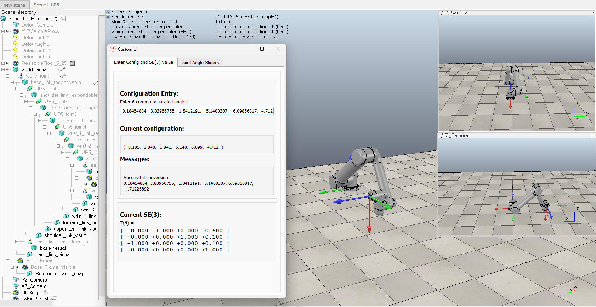

# UR5 Inverse Kinematics — Classical Denavit-Hartenberg Method

A numerical **inverse-kinematics** solver for the **UR5** 6-DOF robot arm, built from the arm's Denavit–Hartenberg parameters. Given a target end-effector pose (position *and* orientation), it iteratively solves for the joint angles that reach it, using forward kinematics, the geometric Jacobian, and an axis–angle orientation error.



> For the example target, the solver converges in **10 iterations** and reproduces the target pose to within **~1×10⁻⁷**. This image was produced in a simulation software called CoppeliaSim.

---

## Overview

Forward kinematics answers "given the joint angles, where is the hand?" Inverse kinematics asks the harder reverse question: "given where I want the hand, what joint angles get it there?" For a 6-DOF arm reaching a full 6-DOF pose there is no simple formula, so this project solves it **numerically**. The script achieves this by starting from an initial guess and stepping the joint angles down the error gradient until the end-effector pose matches the target in both **position** and **orientation**.

## The UR5 model

The arm is described by the standard UR5 Denavit–Hartenberg parameters (lengths in meters):

| Joint | $a$ | $\alpha$ | $d$ |
|---|---|---|---|
| 1 | 0 | $\pi/2$ | 0.089159 |
| 2 | −0.425 | 0 | 0 |
| 3 | −0.39225 | 0 | 0 |
| 4 | 0 | $\pi/2$ | 0.10915 |
| 5 | 0 | $-\pi/2$ | 0.09465 |
| 6 | 0 | 0 | 0.0823 |

Each joint's transform is the classic DH homogeneous matrix:

$$
T_i =
\begin{bmatrix}
\cos\theta_i & -\sin\theta_i\cos\alpha_i & \sin\theta_i\sin\alpha_i & a_i\cos\theta_i\\
\sin\theta_i & \cos\theta_i\cos\alpha_i & -\cos\theta_i\sin\alpha_i & a_i\sin\theta_i\\
0 & \sin\alpha_i & \cos\alpha_i & d_i\\
0 & 0 & 0 & 1
\end{bmatrix}
$$

and forward kinematics is their product, $T_0^6 = T_1 T_2 \cdots T_6$.

## Method

**Geometric Jacobian.** Each column relates a joint's motion to end-effector velocity. For revolute joint $i$ with axis $z_i$ and origin $p_i$ (in base coordinates) and end-effector position $p_e$:

$$
J_i = \begin{bmatrix} z_i \times (p_e - p_i) \\ z_i \end{bmatrix}
$$

stacking into a $6\times6$ matrix mapping joint rates to the end-effector twist.

**Orientation error.** The rotational part of the error can't be a matrix subtraction. The solver forms $R_{\text{err}} = R_{\text{target}}R_{\text{current}}^\top$ and extracts its axis–angle (the SO(3) logarithm): the angle from $\cos\theta = (\mathrm{tr}(R_{\text{err}}) - 1)/2$ and the axis from the skew-symmetric part. This gives a 3-vector orientation error that combines with the 3-vector position error into a single 6-D pose error.

**Iteration.** Each step solves for a joint update from the pose error via the Jacobian and takes a step:

$$
\Delta\theta = J^{+}\,e, \qquad \theta \leftarrow \theta + \text{step}\cdot\Delta\theta
$$

repeating until $\lVert e \rVert$ falls below tolerance. The returned angles are wrapped to $[-\pi, \pi]$.

## Example

The `__main__` block solves for a target pose and prints the per-iteration error:

```python
T_target = np.array([[0, 1, 0, 0.5],
                     [0, 0,-1,-0.1],
                     [-1,0, 0, 0.1],
                     [0, 0, 0, 1.0]])
initial_guess = [-0.27, 4.794, -2.026, -2.634, 3.241, -1.418]
solution = inverse_kinematics(T_target, initial_guess)
```

The error drops from ~2.78 to below $10^{-4}$ in ten iterations, and forward kinematics of the returned angles reproduces `T_target` to $10^{-7}$.

## Repository structure

```
.
├── src/
│   └── IK_solver_DH.py     # DH model, forward kinematics, Jacobian, orientation error, numerical IK
├── results/
│   └── UR5_sim.png         # the example solution, visualized
|   └── work_for_DH_IK.JPG  # the work I performed to get set up the script
└── README.md
```

## How to run

Requirements: **Python 3** and **NumPy**.

```bash
python src/IK_solver_DH.py
```

Edit `T_target` and `initial_guess` at the bottom of the file to solve for a different pose.

## Assumptions & limitations

- **Numerical, local solver.** It returns one solution near the initial guess, not all of the (up to 8) analytic UR5 configurations; a poor seed can converge to a different branch or fail.
- **Singularity sensitivity.** Near kinematic singularities the Jacobian pseudoinverse can produce large joint steps; a damped least-squares (Levenberg–Marquardt) variant is the standard remedy.
- **No joint limits or collision checking.** Solutions may be kinematically valid but physically unreachable on the real arm.
- **Orientation error near 180°.** The axis–angle extraction is ill-conditioned exactly at a π rotation error and needs a special case there.

## Possible extensions

- Damped least squares for robust behavior through singularities.
- Enforce joint limits and add self-collision checks.
- Enumerate all analytic IK solutions and pick the best by a cost (joint travel, manipulability).
- Chain the solver along a Cartesian path for trajectory following.

## Author

Peter Ziegler
